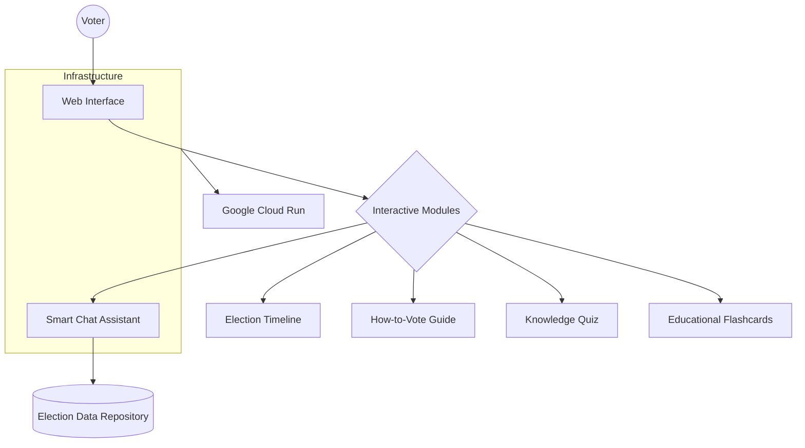
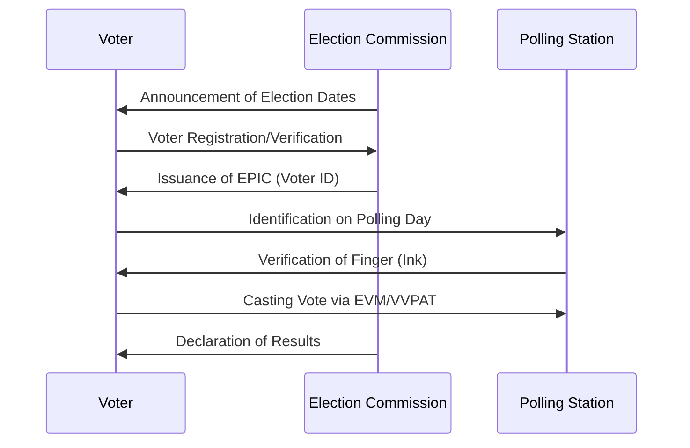

# 🗳️ Vote Assistant - Indian Election Interactive Guide

> **Empowering citizens through knowledge and technology.**

Vote Assistant is a state-of-the-art, interactive web application designed to simplify the complexities of the Indian electoral process. Built with a focus on **User Experience (UX)** and **Educational Clarity**, it serves as a one-stop digital guide for voters navigating the Lok Sabha and State Assembly elections.

---

## 📊 System Overview

The application is architected as a lightweight, high-performance vanilla web app, containerized for scalable deployment.



---

## 🗳️ The Election Journey

Our interactive timeline guides users through the critical phases of the democratic process:



---

## 🌟 Key Features

-   **🕒 Interactive Timeline**: A visual, step-by-step journey through the election cycle, from notification to results.
-   **✅ How-to-Vote Guide**: A simplified 5-step checklist to ensure a smooth experience at the polling booth.
-   **🧠 Educational Flashcards**: Master complex election terminology (like VVPAT, Model Code of Conduct, etc.) with ease.
-   **🏆 Knowledge Quiz**: Gamified learning to test your understanding of Indian democracy.
-   **🤖 Smart Chat Assistant**: A context-aware AI powered by a curated knowledge base to answer instant queries.

---

## 🚀 Getting Started

### Local Development

1.  Clone the repository:
    ```bash
    git clone https://github.com/mahak-khan-py/Election-Assistant.git
    ```
2.  Open `index.html` in any modern web browser.
3.  (Optional) Run a local development server:
    ```bash
    python -m http.server 8000
    ```

### Deployment

This project is optimized for **Google Cloud Run** using Nginx as a high-performance static file server.

1.  **Build Image**: `docker build -t election-assistant .`
2.  **Deploy**: Refer to [deploy.md](./deploy.md) for detailed cloud deployment steps.

---

## 🛠️ Tech Stack

-   **Frontend**: HTML5, Vanilla CSS3 (Custom Design System), JavaScript (ES6+)
-   **Containerization**: Docker (Nginx Alpine)
-   **Deployment**: Google Cloud Platform (Cloud Run)

---

## 📄 License

This project is licensed under the MIT License - see the LICENSE file for details.

